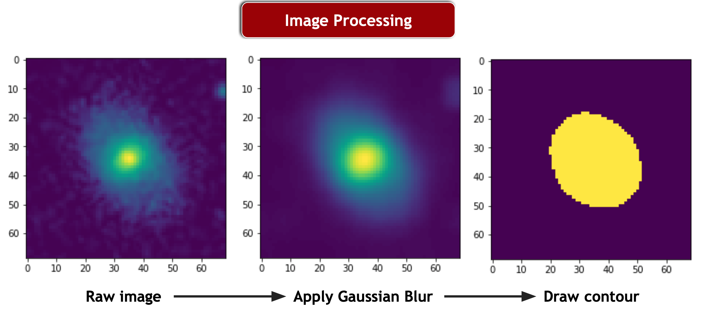
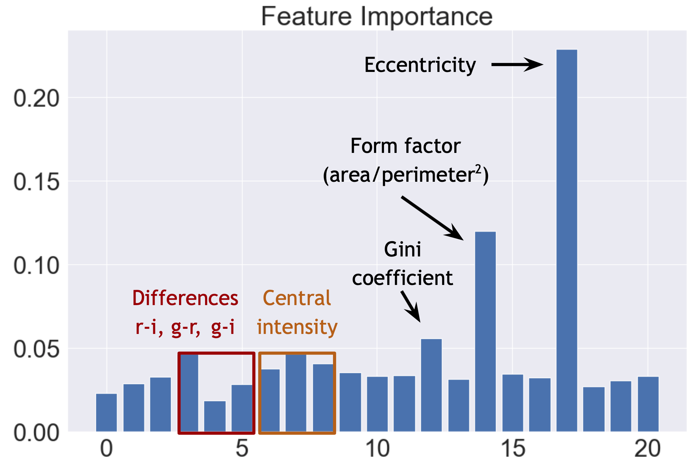
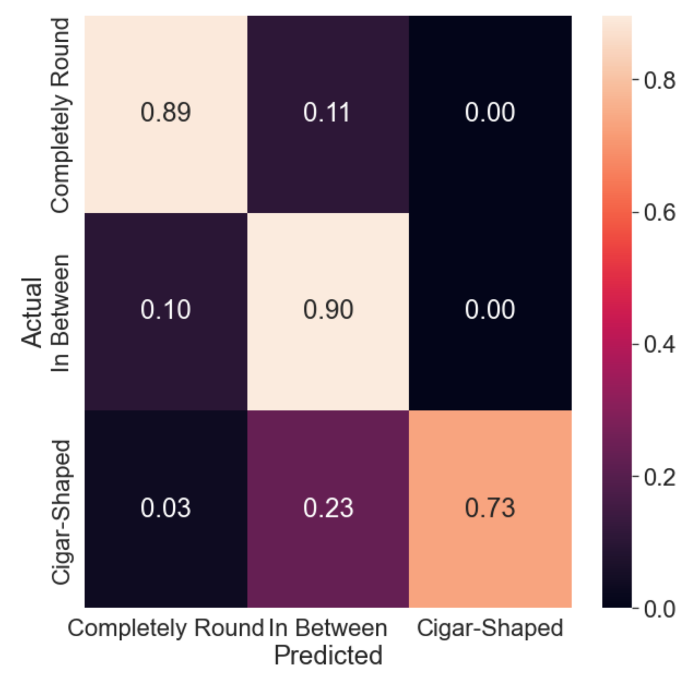
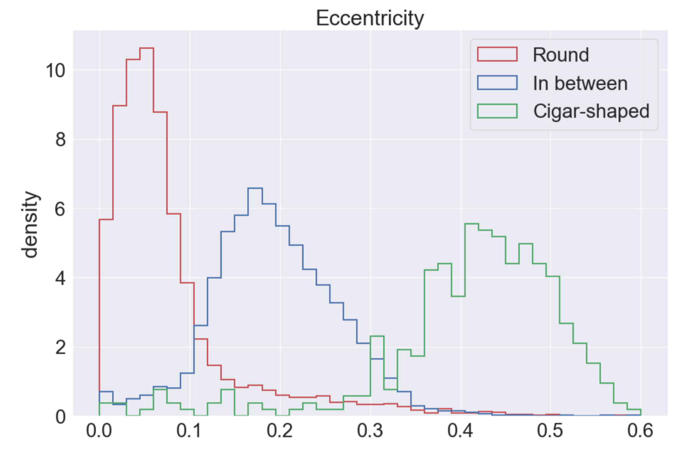

# Galaxy Classification with Random Forest
This is my final project on classifying SDSS galaxy images using random forest classification, which
was part of my Computational Physics class (PHYS 305, The University of Arizona) in Spring 2022.

The Galaxy Zoo project brought citizen scientists to help with classifying millions of
galaxy images from the Sloan Digital Sky Survey. I used a small subset (about 23,000) of galaxy
images that received majority voting in the Galaxy Zoo project to train a random forest classifier.
I used the OpenCV package to process raw optical galaxy images and identify the basic 
shape of the galaxy using contours. 

From the images, I extracted different geometric and photometric features such as eccentricity, 
form factor (area per perimeter squared), and light intensity profiles (galaxy_features_extraction.py). 
I then built a random forest classifier and ran hyperparameter tuning using the scikit-learn package 
(parameter_tuning.py). I tested the random forest classifier on categorizing galaxy images into ten groups 
(galaxy_analysis.py). Finally, I analyzed the predictive performance and the important features on each 
classification layer (other Python files).

I also attach PDFs of my project report and presentation that discusses the background knowledge of this 
project, the analysis I performed, and the outcomes of the project.

